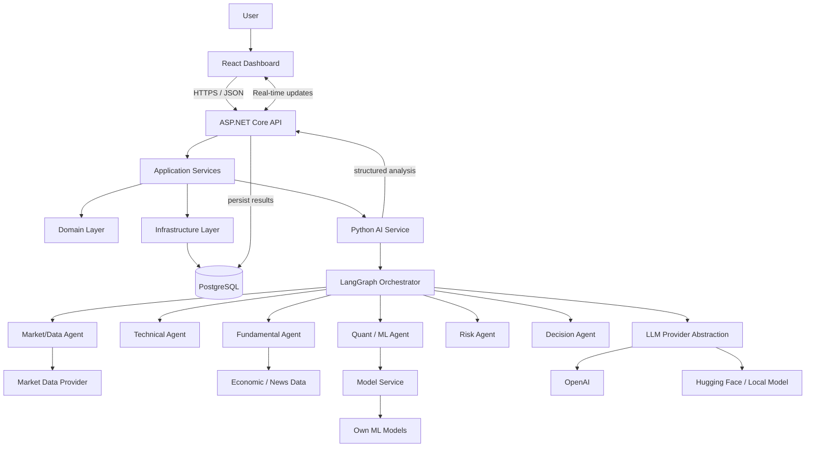
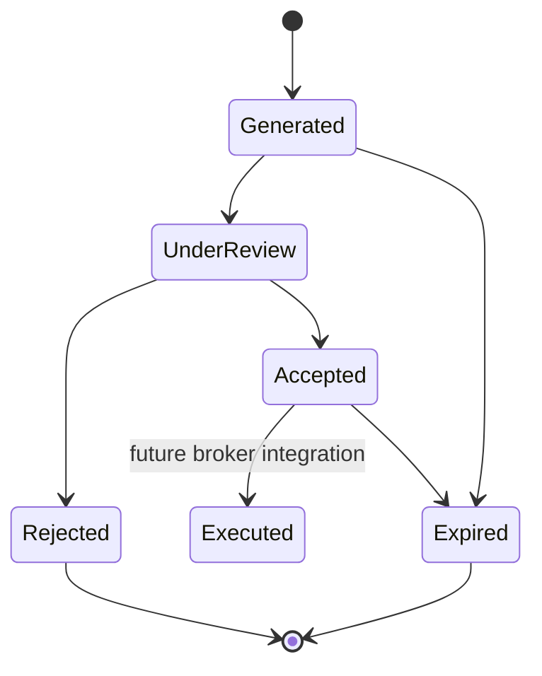

# ForexAI — System Architecture Specification

**Document:** System Architecture + UML Sequence Diagrams  
**Version:** 1.0  
**Status:** Development Baseline  
**System:** ForexAI — Multi-Agent Forex Intelligence Platform

## 1. Architectural Objective

ForexAI is a multi-agent software system that collects near-live foreign-exchange market information, analyses a selected trading pair using specialised AI agents and user-owned ML models, produces a structured trading signal, presents the result through a React dashboard, and requires human approval or rejection before any future execution capability is added.

The architecture follows four primary application boundaries:

- **React:** user experience and visualisation.
- **ASP.NET Core / C#:** application host, API, orchestration of application services, authentication/authorisation, audit, and integration contracts.
- **Python:** AI agents, LangGraph workflows, feature engineering and model inference.
- **PostgreSQL:** persistent application and analytical data.

The baseline is intentionally designed for a portfolio-scale deployment of approximately 3–10 users and prioritises low operating cost.

## 2. Architectural Principles

1. **Separation of concerns:** UI, application logic, AI logic, and persistence remain separate.
2. **AI is an application dependency, not the application itself:** the C# host remains responsible for the product boundary.
3. **Deterministic calculations remain deterministic:** indicators, validation, risk rules, and data-quality checks should not depend on an LLM.
4. **LLMs are replaceable:** OpenAI, Hugging Face/local models, or another provider are accessed through a provider abstraction.
5. **Structured agent outputs:** agents communicate using typed JSON/Pydantic contracts rather than free-form text alone.
6. **Human-in-the-loop:** a signal can be accepted, rejected, or later modified by the user before any execution feature is introduced.
7. **Traceability:** inputs, agent outputs, model versions, decisions, and user actions are persisted for audit and evaluation.
8. **Security by boundary:** agents and model services receive only the data and capabilities they need.
9. **Cost-aware deployment:** services can run locally in Docker during development and be deployed independently later.

## 3. Logical Architecture



## 4. Deployment Architecture

```text
                         Internet
                            |
                  +---------+---------+
                  |                   |
            React Frontend       ASP.NET Core API
                  |                   |
                  +---------+---------+
                            |
                    Internal network
                            |
             +--------------+---------------+
             |                              |
       Python AI Service              PostgreSQL
             |
       +-----+----------------+
       |                      |
   LangGraph              Model Service
       |                      |
   Agents              Own ML Models / LLMs

Development target:
- React: local process
- ASP.NET Core: local process
- Python/FastAPI: local process
- PostgreSQL: Docker container
- Optional Redis later

Production target:
- Frontend and API deployed separately
- Python AI service independently deployable
- Managed or low-cost PostgreSQL
- Model hosting can be local, Hugging Face, or another low-cost provider
```

## 5. Component Responsibilities

### React Dashboard

- Pair and timeframe selection.
- Current price and market status.
- Signal display.
- Agent-by-agent result display.
- Signal accept/reject controls.
- Memory/context display where appropriate.
- Backtest and model-performance screens later.

### ASP.NET Core API

- HTTP API boundary.
- Authentication and authorisation.
- User and portfolio application services.
- Signal lifecycle.
- Validation and business rules.
- Persistence through Infrastructure.
- Calls to the Python AI service.
- Audit logging.
- Future broker integration boundary.

### Python AI Service

- FastAPI service boundary.
- Pydantic request/response schemas.
- LangGraph state and execution.
- Agent implementations.
- Technical indicator calculations.
- Feature generation.
- ML model invocation.
- LLM provider abstraction.
- AI-specific logging and evaluation metadata.

### PostgreSQL

Stores persistent business and AI data, including market candles, indicators, signals, agent runs, model versions, predictions, memory, user actions, and audit records.

## 6. AI Workflow

The initial workflow should be a controlled graph rather than unrestricted agent-to-agent conversation.

```text
Request analysis
      |
      v
Load market context + memory
      |
      v
Market/Data validation
      |
      +-------------------+---------------------+
      |                   |                     |
      v                   v                     v
Technical Agent     Fundamental Agent      Quant/ML Agent
      |                   |                     |
      +-------------------+---------------------+
                          |
                          v
                     Risk Agent
                          |
                          v
                    Decision Agent
                          |
                          v
                   Structured Signal
                          |
                          v
                  Human approval step
                    /             \
                ACCEPT           REJECT
                   |                |
                 Store          Store decision
```

## 7. Signal State Machine



Execution is deliberately marked as future scope. The MVP ends at human-reviewed signals.

## 8. API Boundary

Initial application endpoints should be kept small and explicit.

```text
GET    /api/health
GET    /api/forex/pairs
GET    /api/market/{pair}/candles
GET    /api/market/{pair}/latest
POST   /api/analysis
GET    /api/signals/{id}
POST   /api/signals/{id}/accept
POST   /api/signals/{id}/reject
GET    /api/agents
GET    /api/models
```

Python service:

```text
GET    /health
POST   /ai/analyze
POST   /ai/predict
GET    /ai/agents
```

These endpoints are a starting contract, not a final API specification.

## 9. Cross-Service Contract

The C# API should call Python with a structured request such as:

```json
{
  "pair": "EURUSD",
  "timeframe": "4H",
  "lookback": 200,
  "market_data": [],
  "economic_events": [],
  "memory_context": [],
  "model_profile": "default"
}
```

Python should return structured data:

```json
{
  "analysis_id": "uuid",
  "pair": "EURUSD",
  "direction": "BUY",
  "confidence": 0.78,
  "entry_price": 1.1650,
  "stop_loss": 1.1600,
  "take_profit": 1.1760,
  "risk_reward": 2.2,
  "agents": [],
  "model_predictions": [],
  "risk": {},
  "explanation": "..."
}
```

## 10. Memory Architecture

Memory should be separated by purpose:

- **Session memory:** current conversation/analysis state.
- **Short-term memory:** recent analyses, recent accepted/rejected signals, recent market context.
- **Long-term memory:** durable user preferences, model evaluation history, important historical decisions, and other explicitly retained information.

The MVP should store memory in PostgreSQL. A vector database should not be introduced until retrieval requirements justify it.

## 11. Security Architecture

The initial security boundary should include:

- Secrets stored in environment variables or a secret manager; never committed.
- Separate service credentials for C# and Python.
- Database least-privilege accounts.
- Agent tool access restricted by allow-list.
- User input treated as untrusted prompt content.
- Prompt injection resistance through system/developer instructions, input filtering, tool restrictions, and structured outputs.
- Validation of model outputs before a signal can enter the signal lifecycle.
- Audit events for user acceptance/rejection and system decisions.

## 12. Observability

Record at minimum:

- request ID / correlation ID,
- agent run ID,
- model provider,
- model version,
- timestamps,
- execution status,
- validation failures,
- latency,
- token/usage metadata where available,
- final signal,
- user approval/rejection.

## 13. Non-Functional Targets

| Area | MVP target |
|---|---|
| Market freshness | Aim for <5 seconds; maximum 1 minute delay |
| Users | 3–10 concurrent users |
| Availability | Online and shareable |
| Security | Authentication, authorisation, secrets protection, agent/tool restrictions |
| Cost | Minimise recurring cost; local-first development |
| Testability | Unit + integration + contract tests; backtesting before execution |
| Explainability | Persist agent outputs and final decision rationale |

## 14. Architecture Decision Records To Create

- ADR-001: Why React + ASP.NET Core + Python.
- ADR-002: Why Python is isolated as an AI service.
- ADR-003: Why LangGraph is used for orchestration.
- ADR-004: Why PostgreSQL is the system of record.
- ADR-005: LLM provider abstraction.
- ADR-006: Human-in-the-loop signal approval.
- ADR-007: Local-first / low-cost deployment strategy.
- ADR-008: Security model for agent tools and prompt inputs.

