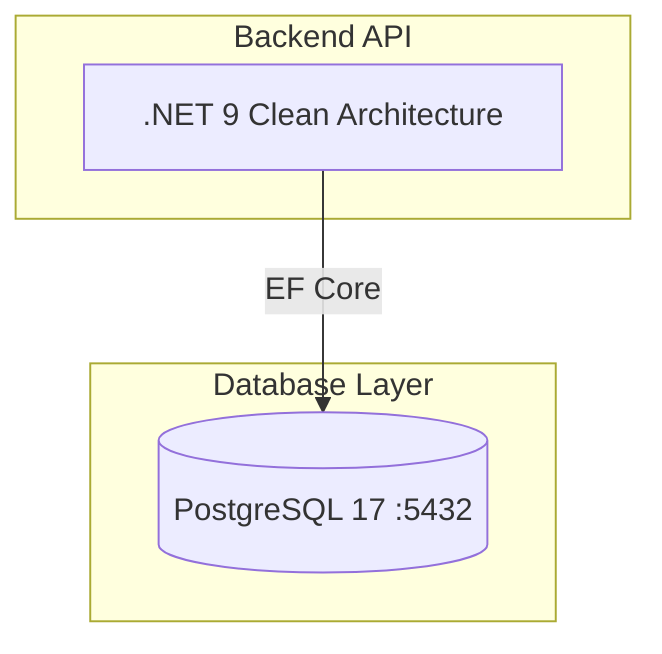

<div align="center">

# ForexAI — AI-Powered Forex Trading Platform

**A full-stack trading platform: a React dashboard, a .NET 9 Clean Architecture API, and a Python AI microservice that turns market data into risk-gated trading signals.**


</div>

---

## Overview

ForexAI is a monorepo containing the whole platform. A trader picks a pair and
timeframe in the browser; the dashboard calls a .NET API which persists signals
and forwards the request to a Python AI service. That service runs a six-node
LangGraph pipeline — candle data, three independent specialists (technical,
fundamental, quant), a risk gate, and a final decision — and returns a single
recommendation with entry price, stop-loss, take-profit and reasoning.

Every layer is deployable on its own and the whole stack boots with one command.


## Architecture



| Component | Path | Stack | Role |
| --- | --- | --- | --- |
| **Dashboard** | [`forexai-dashboard/`](./forexai-dashboard) | React 19 · TypeScript · Vite · lightweight-charts · nginx | Charts, signal history, request flow for the trader. |
| **API** | [`ForexAI/`](./ForexAI) | .NET 9 · Clean Architecture (Api / Application / Domain / Infrastructure) · xUnit | Auth (JWT), persistence, orchestration of the AI service, migrations. |
| **AI service** | [`forexai-ai/`](./forexai-ai) | Python 3.14 · FastAPI · LangGraph · scikit-learn / XGBoost | Market data, multi-agent analysis, risk gating, signal generation. |
| **Compose stack** | [`docker-compose.yml`](./docker-compose.yml) | Docker Compose | Wires all of the above together with PostgreSQL. |

<a id="quick-start"></a>
## Quick start

**Requirements:** Docker + Docker Compose (and, for a full run, API keys — see [Configuration](#configuration)).

```bash
git clone https://github.com/MBKNgcobo/ForexAI_signal_generator.git
cd ForexAI_signal_generator

cp .env.example .env      # then fill in real values
docker compose up -d
```

| Service | URL |
| --- | --- |
| Dashboard | http://localhost |
| .NET API | http://localhost:8080 |
| AI service | http://localhost:8001 (`/health`, `/docs`) |
| PostgreSQL | localhost:5434 |

`docker compose up` builds every image, waits for PostgreSQL to become healthy,
runs the EF Core migration job, then starts the API and dashboard.

### Develop locally

```bash
# AI service — hot reload, independent of the stack
cd forexai-ai
python -m venv .venv && source .venv/bin/activate
pip install -r requirements.txt
uvicorn app.main:app --reload

# API
cd ForexAI
dotnet run --project ForexAI.Api

# Dashboard
cd forexai-dashboard
npm install && npm run dev
```

See each component's README for detail: [forexai-ai](./forexai-ai/README.md) · [ForexAI](./ForexAI/README.md) · [forexai-dashboard](./forexai-dashboard/README.md).

## How a signal is produced

1. **Fetch** — candles come from Twelve Data with a 30-second TTL cache; timestamps are normalised across six timeframes.
2. **Specialise** — three agents form opinions independently: technical (EMA / RSI / ATR), fundamental (World Bank + optional PostgreSQL RAG evidence), quant (21-feature ensemble of logistic regression, random forest and XGBoost).
3. **Gate** — the risk agent requires a directional majority, scores agreement, checks minimum risk:reward, derives stop-loss (1.0× ATR) and take-profit (1.5× ATR), and applies an explicit veto when a strong quant signal opposes the majority.
4. **Decide** — the decision agent emits one direction, a confidence and a written rationale, or `NO_TRADE`.
5. **Persist** — the .NET API stores the signal and returns it to the dashboard.

<a id="configuration"></a>
## Configuration

The root `.env` (create it from [`.env.example`](./.env.example)) feeds
`docker-compose.yml`. The essentials:

| Variable | Used by | Purpose |
| --- | --- | --- |
| `POSTGRES_*` / `DATABASE_PASSWORD_URLENCODED` | API, AI, DB | Database credentials (compose does **not** URL-encode for you). |
| `JWT_KEY` / `JWT_ISSUER` / `JWT_AUDIENCE` | API | Token signing for dashboard auth. |
| `TWELVE_DATA_API_KEY` | AI service | Candle data; missing → `503` on `/market-data`. |
| `LLM_PROVIDER` + keys | AI service | `openrouter` (default), `openai` or `http`, with fallback models and retries. |
| `SOTW_API_KEY` / `BUSINESS_QUANT_API_KEY` | AI service | Optional fundamentals sources. |
| `CORS_ALLOWED_ORIGIN` | API | Origin the dashboard calls from. |

Each component also has its own contract file — [`forexai-ai/.env.example`](./forexai-ai/.env.example)
documents every variable the AI service understands.

**Secrets never enter git or image layers:** `.env` is ignored at the repo root,
by each sub-project's `.gitignore`, and by every `.dockerignore`; credentials are
injected as runtime environment variables only.

<a id="testing"></a>
## Testing

```bash
# Python AI service — 78 hermetic tests, no network, no credentials
cd forexai-ai && python -m pytest -q

# .NET API — unit tests
cd ForexAI && dotnet test

# Dashboard — type-check, lint, build
cd forexai-dashboard && npm run build && npm run lint
```

GitHub Actions ([`.github/workflows/ci.yml`](./.github/workflows/ci.yml)) runs
the Python suite on every push and pull request. The suite fakes market data,
the LLM and the database, so CI needs no secrets.

## Repository layout

```
ForexAI_signal_generator/
├── docker-compose.yml        # postgres + api + ai service + dashboard
├── .env.example              # environment contract for compose
├── .github/workflows/ci.yml  # CI
├── ForexAI/                  # .NET 9 API (Clean Architecture + xUnit)
│   ├── ForexAI.Api/            # controllers, Program.cs, migrations
│   ├── ForexAI.Application/    # use cases, contracts, interfaces
│   ├── ForexAI.Domain/          # entities, domain rules
│   ├── ForexAI.Infrastructure/  # EF Core, repositories, external clients
│   └── ForexAI.Tests/           # xUnit suite
├── forexai-ai/               # Python AI microservice (FastAPI + LangGraph)
│   ├── app/agents/             # market data, technical, fundamental, quant, risk, decision
│   ├── app/api/                # routers, validation, X-API-Key guard
│   ├── app/llm/                # provider factory, retries, typed errors
│   ├── app/models/             # 21-feature engineering, LR/RF/XGBoost
│   └── tests/                  # 78-test hermetic suite
├── forexai-dashboard/        # React 19 + Vite + lightweight-charts
└── ForexAI_Architecture_v1.0/ # architecture documentation
```

## Engineering highlights

- **Fail-soft by design** — the AI service starts without credentials, keeps `/health` alive, and returns `503` with `Retry-After` from the endpoint that actually needs the missing dependency.
- **Validation at the HTTP boundary** — bad symbols, timeframes and limits are rejected with `422` before any paid LLM or provider call.
- **Typed error contract** — `400` unsupported input · `401` auth · `422` schema · `502` unusable LLM output · `503` degraded dependency.
- **Hermetic tests** — 78 Python tests with zero network access; CI runs without secrets.
- **Security** — optional constant-time `X-API-Key` guard, conditional CORS, JWT auth, non-root Docker images, secrets excluded from every image layer.
- **Clean Architecture** on the .NET side keeps domain rules independent of EF Core and the transport layer, with an xUnit suite covering the use cases.

## Roadmap

- [ ] Pluggable candle providers behind the existing `MarketDataProvider` interface.
- [ ] Contract tests generated from the OpenAPI schema to catch drift against the .NET client.
- [ ] Prometheus metrics and structured JSON logs across services.
- [ ] Per-symbol rate limiting and cache warm-up for the provider layer.

---

<div align="center">
<sub>Built by <a href="https://github.com/MBKNgcobo">MBKNgcobo</a> · ForexAI signal generator</sub>
</div>
