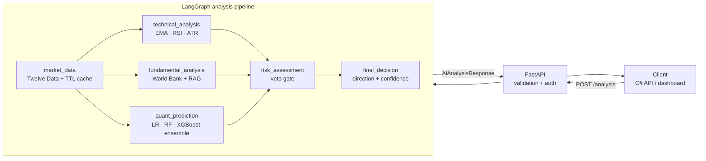

<div align="center">

# ForexAI — Multi-Agent Forex Signal Service

> Part of the **[ForexAI platform](../README.md)** · siblings: [`ForexAI/`](../ForexAI/README.md) (.NET API) · [`forexai-dashboard/`](../forexai-dashboard/README.md) (frontend)

**A production-shaped FastAPI service that turns raw market data into a single, risk-gated trading recommendation.**


[Features](#features) · [Architecture](#architecture) · [API](#api) · [Quick start](#quick-start) · [Tests](#tests)

</div>

---

## Overview

ForexAI is the AI microservice behind a forex trading platform. It runs a
six-node **LangGraph** pipeline: fetch candles, let three independent
specialists form an opinion (technical, fundamental, quant), then force those
opinions through a **risk gate** that can veto or downgrade them before a final
decision is emitted.

The service is designed to behave well in the real world — it starts without
credentials, validates at the HTTP boundary, distinguishes *client error* from
*provider outage*, and keeps secrets out of the image, the repo and the logs.

<a id="features"></a>
### Highlights

- **Multi-agent analysis** — technical, fundamental and quant specialists feed a risk gate; disagreements and vetoes are first-class outcomes, not exceptions.
- **Risk-first design** — no signal is approved without majority agreement, a minimum risk:reward, ATR-derived stop-loss/take-profit, and an explicit veto for a strong opposing quant signal.
- **Fail-soft configuration** — a missing API key never crashes the process. `/health` stays up; the affected endpoint returns `503` with `Retry-After` and an actionable message.
- **Validation at the boundary** — malformed symbols, timeframes and limits return `422` *before* any paid LLM or provider work happens (previously they surfaced as `500`s mid-flight).
- **Typed error mapping** — `400` unsupported pair · `401` bad API key · `422` bad input · `502` unusable LLM output · `503` degraded dependency.
- **Provider-agnostic LLM layer** — OpenRouter (with fallback models), OpenAI or any HTTP endpoint, behind one factory with a typed retry/error taxonomy.
- **Hermetic test suite** — 150 tests, zero network access: market data, the LLM and the database are all faked.
- **Secure defaults** — optional `X-API-Key` guard, conditional CORS, non-root Docker image, health-check, secrets excluded from git *and* image layers.

<a id="architecture"></a>
## Architecture



| Node | Responsibility |
| --- | --- |
| `market_data` | Fetches candles via Twelve Data, normalises timestamps across six timeframes, 30-second TTL cache. |
| `technical_analysis` | EMA, RSI and ATR derived from the candles; the LLM turns indicator state into a direction + confidence. |
| `fundamental_analysis` | World Bank indicators with an optional PostgreSQL RAG store for supporting evidence. |
| `quant_prediction` | 21-feature inference through an ensemble of logistic regression, random forest and XGBoost. |
| `risk_assessment` | Majority vote, agreement score, minimum risk:reward, ATR stop-loss (1.0×) and take-profit (1.5×), quant veto. |
| `final_decision` | Collapses everything into one direction, confidence and reasoning — or `NO_TRADE`. |

## API

| Method | Path | Notes |
| --- | --- | --- |
| `GET` | `/health` | Liveness probe, always public; reports service name and version. |
| `GET` | `/ready` | Readiness probe: `200` when required configuration is present, else `503`. |
| `GET` | `/version` | Build metadata (`service`, `version`) for dashboards and deploy checks. |
| `GET` | `/metrics` | Prometheus scrape endpoint (HTTP, graph-node, cache and LLM metrics). |
| `GET` | `/market-data/{symbol}` | Six-letter symbol (`EURUSD`), `timeframe`, `limit` (1–500). |
| `POST` | `/analysis` | Full pipeline: `{ forex_pair_id, symbol, timeframe }`. Calibrated confidences + `explanation` block. |
| `POST` | `/analysis/batch` | Up to `ANALYSIS_BATCH_LIMIT` (default 10) pairs in one call; per-item `results`/`errors`; optional `webhook_url` push. |

Valid timeframes: `OneMinute` · `FiveMinutes` · `FifteenMinutes` · `OneHour` · `FourHours` · `OneDay`

### Example

```bash
curl -X POST http://localhost:8001/analysis \
  -H "Content-Type: application/json" \
  -d '{"forex_pair_id":"EURUSD","symbol":"EURUSD","timeframe":"FifteenMinutes"}'
```

Response (`200`, abridged — every specialist is always present):

```json
{
  "symbol": "EURUSD",
  "timeframe": "FifteenMinutes",
  "technical_analysis":   { "direction": "BUY",   "confidence": 0.72, "summary": "…" },
  "fundamental_analysis": { "direction": "BUY",   "confidence": 0.60, "summary": "…" },
  "quant_prediction":     { "direction": "SELL",  "confidence": 0.55, "summary": "…" },
  "risk_assessment": {
    "risk_level": "MEDIUM",
    "approved": true,
    "agreement": 0.67,
    "reason": "Specialists agree on the direction…",
    "entry_price": 1.1251,
    "stop_loss": 1.1185,
    "take_profit": 1.1350,
    "risk_reward": 1.5
  },
  "final_decision": { "direction": "BUY", "confidence": 0.66, "reasoning": "…" }
}
```

When the guard is enabled, the header `X-API-Key: <AI_SERVICE_API_KEY>` is required.

### Error contract

| Status | Meaning |
| --- | --- |
| `400` | Well-formed but unsupported symbol / forex pair. |
| `401` | `X-API-Key` missing or wrong (only when `AI_SERVICE_API_KEY` is set). |
| `422` | Schema validation failure — symbol shape, timeframe, `limit` range. |
| `502` | The LLM returned unusable or incomplete output (`AnalysisIncompleteError`). |
| `503` | Missing configuration, rate-limited LLM, or exhausted market-data quota (`Retry-After` is sent). |

<a id="quick-start"></a>
## Quick start

**Requirements:** Python 3.14 · a [Twelve Data](https://twelvedata.com/) key · an LLM key (OpenRouter by default) · PostgreSQL *(optional — only needed for fundamental analysis)*

```powershell
# Windows
python -m venv .venv
.venv\Scripts\Activate.ps1
pip install -r requirements.txt

copy .env.example .env    # fill in real values
uvicorn app.main:app --reload
```

```bash
# Linux / macOS
python -m venv .venv && source .venv/bin/activate
pip install -r requirements.txt
cp .env.example .env && $EDITOR .env
uvicorn app.main:app --reload
```

Startup logs a configuration summary (`Configuration OK (LLM provider: openrouter)`)
without ever printing a credential.

### Configuration

`.env.example` is the complete environment contract. The essentials:

| Variable | Purpose |
| --- | --- |
| `TWELVE_DATA_API_KEY` | Market data. Missing → `503` on `/market-data` and in the graph. |
| `LLM_PROVIDER` + keys | `openrouter` (default), `openai` or `http`; fallback models, retries and deadlines are tunable. |
| `RAG_DB_*` | PostgreSQL connection for fundamental evidence. |
| `CORS_ALLOWED_ORIGIN` | Comma-separated browser origins. Empty disables CORS entirely. |
| `AI_SERVICE_API_KEY` | Optional shared secret enabling the `X-API-Key` guard. Unset = disabled. |
| `LOG_LEVEL` | `DEBUG` / `INFO` / `WARNING` / `ERROR` (default `INFO`). |

Never commit `.env` — it is ignored by `.gitignore` and `.dockerignore`.

<a id="tests"></a>
## Tests

```powershell
python -m pytest -q                 # 150 passed
python -m pytest -q --cov=app       # with a coverage report
ruff check app tests                # lint gate

**Product-value endpoints (P1–P4):** per-source confidence calibration
(`models/calibration.json`, raw values kept as `raw_confidence`),
an auditable `explanation` block (`drivers`/`dissent`, quant-veto flag),
`POST /analysis/batch` for watchlists (per-item errors, `ANALYSIS_BATCH_LIMIT`),
and best-effort `webhook_url` push guarded by `WEBHOOK_ALLOWLIST` (deny-all by
default; localhost allowed for local receivers).
```

The suite is **hermetic by construction**: candle fetches, LLM calls and the
database are all injected or monkeypatched, so CI needs no credentials and
makes no network calls. Coverage spans API validation and the error contract,
the risk and decision agents, response mapping, timestamp normalisation across
all timeframes, the quant pipeline (feature engineering, target labelling, the
ensemble and the sklearn inference contract), the market-data cache TTL, and
the full graph round-trip.

Configuration lives in `pyproject.toml` (`testpaths`, `asyncio_mode = "auto"`,
`pythonpath = ["."]`), lint rules live under `[tool.ruff]`, and
`.github/workflows/ci.yml` runs `ruff` plus the suite on every push and pull
request. Development-only tooling (`ruff`, `pytest-cov`) is pinned in
`requirements-dev.txt` so the runtime image never carries it.

## Docker

```powershell
docker build -t forexai-ai .
docker run -p 8000:8000 --env-file .env forexai-ai
```

Or run the whole platform (Postgres + AI service + C# API + dashboard):

```powershell
docker compose up -d
```

The image copies only `app/` and `models/` (`.dockerignore` keeps `.env`,
datasets, tests and caches out), runs as an unprivileged `appuser` (uid 10001),
and declares a `HEALTHCHECK` against `/health`.

## Project structure

```
app/
  agents/        specialist nodes — market data, technical, fundamental, quant, risk, decision
  api/           routers, request validation, X-API-Key guard
  backtesting/   simple trade simulation engine
  data/          candle downloaders (generated CSVs are git-ignored)
  fundamentals/  World Bank clients + PostgreSQL RAG store
  graphs/        LangGraph composition of the six nodes
  llm/           provider factory, retry/fallback policy, typed error taxonomy
  models/        21-feature engineering, training and inference (LR / RF / XGBoost)
  schemas/       pydantic request/response contracts
  services/      Twelve Data provider, TTL cache, indicators, response mapper
scripts/         manual data & ensemble checks (not collected by pytest)
tests/           150-test hermetic suite + fakes
  observability/ request IDs, JSON log formatter, Prometheus metrics
.github/         CI workflow (ruff + pytest on every push / PR)
requirements-dev.txt  dev & CI tooling (ruff, pytest-cov)
```

## Design decisions

| Decision | Why |
| --- | --- |
| Lazy provider construction instead of import-time asserts | A container started without an environment file must still import and serve `/health`. |
| Validation in pydantic, not inside route bodies | Bad input is rejected *before* provider/LLM spend, and clients get `422` instead of `500`. |
| Typed `AnalysisIncompleteError` instead of a raw `KeyError` | LLM output is untrusted input; mapping it to `502` keeps stack traces out of responses. |
| `secrets.compare_digest` for the shared API key | Constant-time comparison avoids timing side channels. |
| Cached config with explicit `cache_clear()` hooks in tests | Fast hot path without hidden global mutable state. |
| Canonical `FEATURE_COLUMNS` / `CLASS_NAMES` modules | Training and inference previously drifted across four duplicated copies. |
| Non-root image, no `.env` in image layers | Secrets belong in runtime env vars, never in image history. |
| Dev tooling isolated in `requirements-dev.txt` | The shipped image installs only `requirements.txt`, so `ruff`/`pytest-cov` never reach production. |
| Separate `/health` (liveness) and `/ready` (readiness) | Fail-soft startup keeps the process alive without credentials, so orchestrators need a way to hold traffic until config is present. |

## Roadmap

- [ ] Pluggable candle providers behind the existing `MarketDataProvider` interface (Twelve Data is the only implementation today).
- [x] Prometheus metrics (`/metrics`), structured JSON logs (`LOG_FORMAT=json`) and request IDs (`X-Request-ID`).
- [ ] Contract tests generated from the OpenAPI schema to catch drift against the C# client.
- [ ] Per-symbol rate limiting and cache warm-up for the provider layer.
